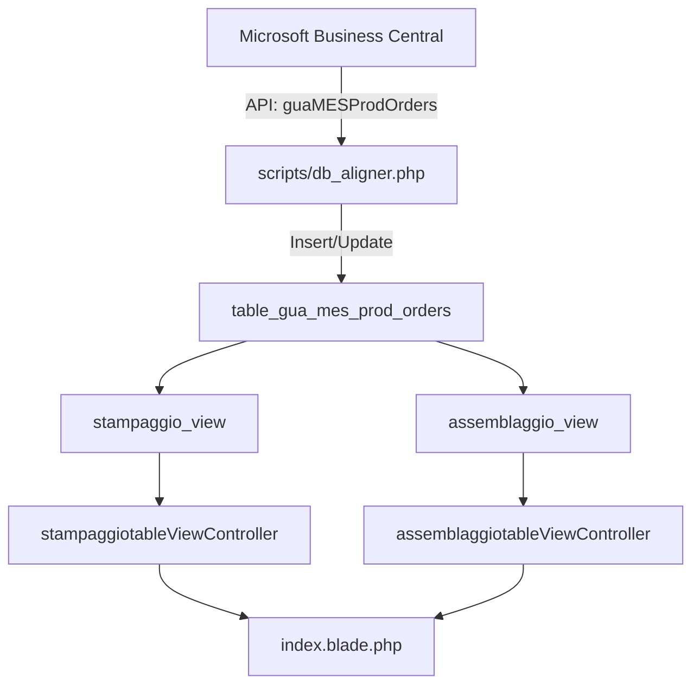

# Data Sourcing Report: Production Status (mesStatus)

## 1. Executive Summary
This report analyzes the sourcing and data flow of the **Production Status** (`mesStatus`) used in the **Stampaggio** (Molding) and **Assemblaggio** (Assembly) monitors. 

**Key Finding**: The status indicators (Yellow/Red/Green dots) are **NOT real-time** from the machine PLCs. They are sourced from the **Business Central ERP** via a periodic synchronization script (`db_aligner.php`).

---

## 2. Frontend Implementation
**File**: `resources/views/app/APP1/index.blade.php`

The frontend uses **ag-Grid** to display the status. The `mesStatus` field drives the visual indicators:

| Status Value | Visual Indicator | Condition |
| :--- | :--- | :--- |
| `Active` | 🟡 Yellow Dot (`.dot.yellow`) | Production is active in ERP. |
| `Stop` / `Pause` | 🔴 Red Dot (`.dot.red`) | Production is stopped/paused in ERP. |
| `Complete` | 🟢 Green Dot (`.dot.green`) | Production order is marked complete. |
| *Other* | ⚪ Grey Dot (`.dot`) | Default state. |

**Code Snippet**:
```javascript
cellRenderer: function(params) {
    if (params.data && params.data.is_group) return "";
    return params.data.mesStatus === 'Active' ? "<div class='dot yellow'></div>" : "<div class='dot'></div>";
}
```

---

## 3. Backend Data Flow

### Controllers
The frontend fetches data via two main endpoints:
1.  **Stampaggio**: `stampaggiotableViewController::index` (Route: `/tableview`)
2.  **Assemblaggio**: `assemblaggiotableViewController::index` (Route: `/tableviewAssemblaggio`)

Both controllers query **SQL Views** rather than raw tables to format the data for the grid.

### Database Layer
*   **Source Table**: `table_gua_mes_prod_orders`
    *   This is the central fact table containing all production orders.
    *   Column: `mesStatus` (VARCHAR)
*   **Views**:
    *   `stampaggio_view`: Filters `table_gua_mes_prod_orders` for Molding orders (e.g., `mesOrderNo LIKE '%ST%'`).
    *   `assemblaggio_view`: Filters `table_gua_mes_prod_orders` for Assembly orders (e.g., `mesOrderNo LIKE '%AS%'`).

---

## 4. Data Ingestion (ETL Process)

The data is populated by an external PHP script running as a background task.

**Script**: `scripts/db_aligner.php`
**Trigger**: Console command `app:importa-dati-esterni`

### ETL Logic
1.  **Source**: Connects to **Microsoft Business Central API** (ROProduction environment).
    *   Endpoint: `/guaMESProdOrders`
2.  **Process**:
    *   Fetches all open production orders.
    *   **Truncates** (clears) the local `table_gua_mes_prod_orders` (via `_tmp` table swap).
    *   **Inserts** fresh data from Business Central.
3.  **Mapping**:
    *   `$v["mesStatus"]` (API) → `mesStatus` (Database).

### Data Freshness
*   **Latency**: The data is as fresh as the last execution of `db_aligner.php`.
*   **Note**: While `mesStatus` comes from BC, the **Produced Quantity** (`quantita_prodotta`) for *Assembly* orders is updated separately by `scripts/assemblaggio_aligner.php`, which queries the **STAIN** database directly. This creates a scenario where *Quantity* might be more real-time than *Status*.

---

## 5. Data Flow Diagram



## 6. Recommendations
If real-time machine status (Running/Stopped) is required directly from the shop floor (STAIN/Machine PLCs) instead of the ERP status:
1.  **Modify** `stampaggio_view` and `assemblaggio_view` to join with the `machine_live_statuses` (or `bisio_progetti_stain`) table.
2.  **Update** the frontend to use a new status field (e.g., `machine_realtime_status`) instead of `mesStatus`.
